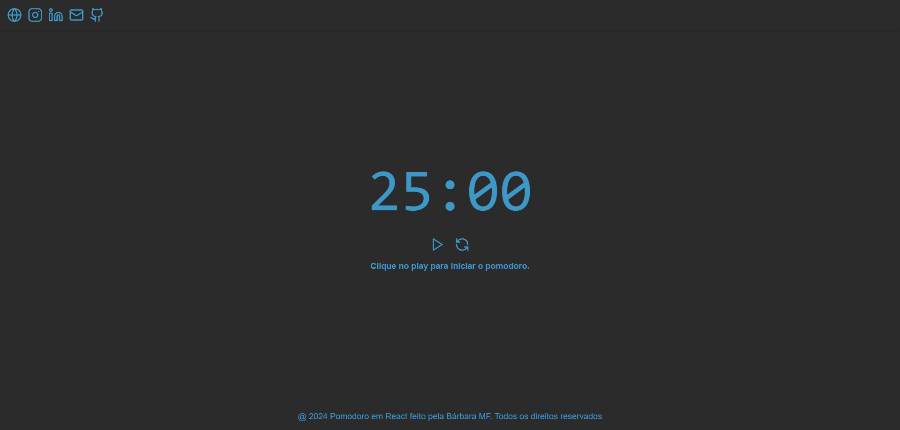

# __Pomodoro em ReactJS__

Projeto construído para o desenvolvimento de um Pomodoro feito em React.js.

**[🔗 Clique aqui para acessar o projeto rodando](https://pomodoro-react-bamarcheti.vercel.app/)**

**[🔗 Clique aqui para acessar o repositório do projeto](https://github.com/Bamarcheti/pomodoro-react)**

## **🛠 Tecnologias**

>### *Frontend*

>### *Bibliotecas e Ferramentas*

# **✨ Como executar**

**Para que esse projeto funcione corretamente, é preciso estar com o servidor rodando.**

>- Entre na pasta para iniciar a execução `cd blog-next`.
>- Instale os pacotes com `yarn install` ou `yarn`.
>- Execute `yarn start` para iniciar o servidor.

## **💛 Contato**

